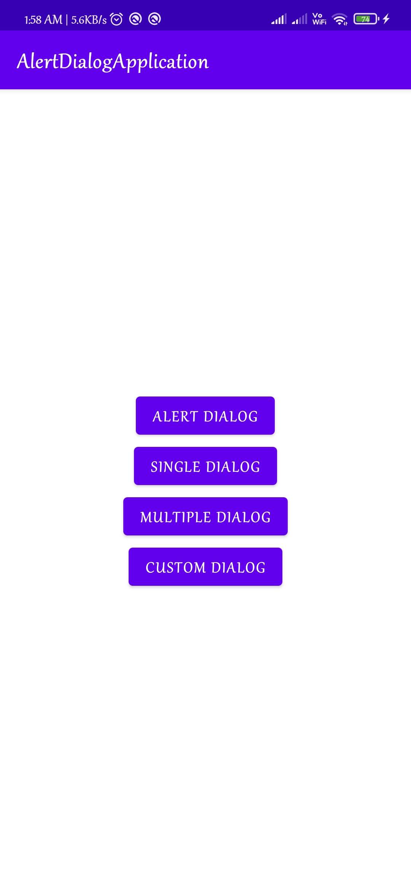
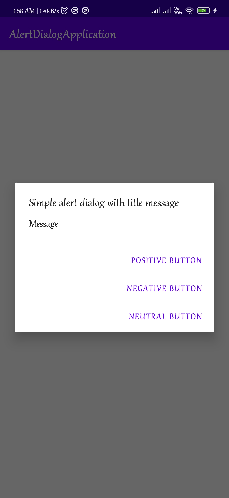
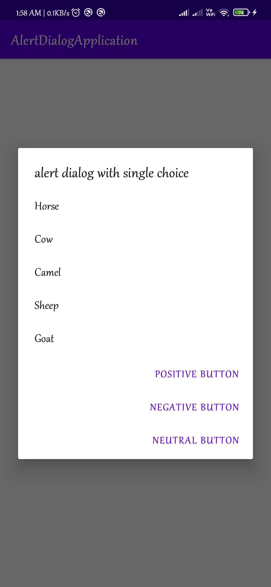
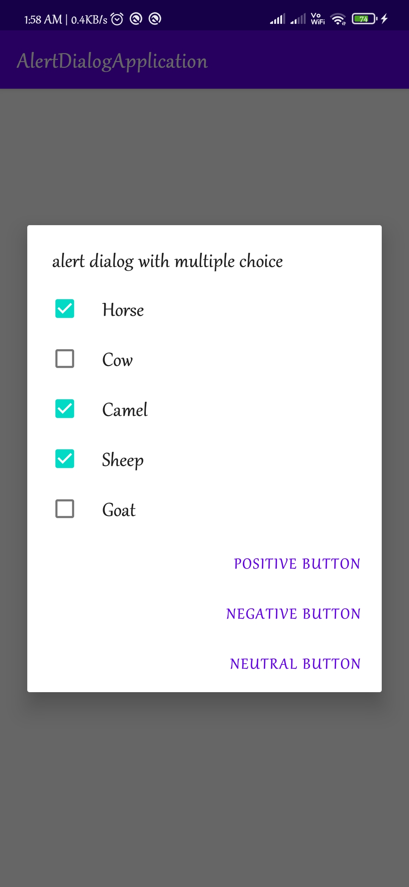

# AlertDialogApplication
 <html>
 <body>

This is the simple alert dialog developer in Kotlin language. This code contains simple alert dialog, single choice alert dialog, multi choice alert dialog and bottomsheet dialog

</body>
</html>

